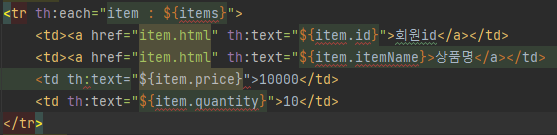

## 1. 상품 도메인 개발

멀티 스레드 환경에서는 여러명이 동시에 스토어에 접근하므로 HashMap을 사용하면 안된다.  

ConcurrentHashMap을 사용하면 된다.  

> #중복보다는 명확성을 따르는게 좋다.

## 2. 상품 서비스 HTML

HTML을 편리하게 개발하기 위하여 부트스트랩을 사용할 수 있다.

부트스트랩 공식 사이트: https://getbootstrap.com

부트스트랩(Bootstrap)은 웹사이트를 쉽게 만들 수 있게 도와주는 HTML, CSS, JS 프레임워크이다.  
하나의 CSS로 휴대폰, 태블릿, 데스크탑까지 다양한 기기에서 작동한다.  
다양한 기능을 제공하여 사용자가 쉽게 웹사이트를 제작, 유지, 보수할 수 있도록 도와준다.

/resource/static 경로에 넣어두면 스프링 부트가 정적 리소스를 제공한다.

정럭 리소스다보니, 해당 파일을 탐색기를 통해 직접 열어도 동작하는 것을 확인할 수 있다.

그런데 이렇게 HTML을 넣어두면 실제 서비스에서도 파일이 공개된다.

서비스를 운영할 때 공개할 필요가 없는 HTML을 두는 것은 주의하여야 한다.

## 3. 상품 목록 - 타임리프

타임리프 사용 선언  
`<html xmlns:th="http://www.thymeleaf.org">`

강의 따라하면 진행 중 item.html에서 타임리프 문법이 적용되지 않는 문제가 발생하였다.  

질문에서 찾아보니 Spring Boot 버전 문제로 확인이 되었다.  

작성할 때 2.7.1 버전이였는데, 글에서 설명해주는 2.6.8로 수정하니 정상적으로 작동되었다.  

> 2.6.8로 작동 테스트 후 다시 2.7.1로 올리고 재시작 하였는데 정상 작동 되는것을 확인하였습니다.  
> 2.7.1에서 문제가 있던 파일을 2.6.8에서 설치되면서 수정된것이 아닐까 생각됩니다.

**타임리프 핵심**

핵심은 th:xxx 가 붙은 부분은 서버사이드에서 렌더링 되고, 기존 것을 대체한다.  
th:xxx 이 없으면 기존 html의 xxx 속성이 그대로 사용된다.  
HTML을 파일로 직접 열었을 때, th:xxx 가 있어도 웹 브라우저는 th: 속성을 알지 못하므로 무시한다.  
따라서 HTML을 파일 보기를 유지하면서 템플릿 기능도 할 수 있다.

**리터럴 대체 문법 = |...|**  

문자와 표현식 등은 분리되어 있기 때문에 더해서 사용해야 한다.  
그럴 경우 사용하기 좋은게 리터럴 대체 문법이다.

사용 전 -> ``  
사용 후 -> ``

**반복 출력 - th:each**

반복문 형태를 보여주기 위해 사용되는 형태이다.  

**내용 변경 - th:text**

내용의 값을 'th:text'의 값으로 변경한다.

> 순수 HTML을 그대로 유지하면서 뷰 템플릿도 사용할 수 있는 타임리프의 특징을 네츄럴 템플릿(natural templates)

> 타임리프는 순수 HTML 파일을 웹 브라우저에서 열어도 내용을 확인할 수 있고, 서버를 통해 뷰 템플릿을
거치면 동적으로 변경된 결과를 확인할 수 있다.  
> 
> JSP를 생각해보면, JSP 파일은 웹 브라우저에서 그냥 열면 JSP 소스코드와 HTML이 뒤죽박죽 되어서 정상적인 확인이 불가능하다.
> 
> 오직 서버를 통해서 JSP를 열어야 한다.

## 4. 상품 상세

## 5. 상품 등록 폼

## 6. 상품 등록 처리 @ModelAttribute

## 7. 상품 수정

## 8. PRG Post/Redirect/Get

## 9. RedirectAttributes

