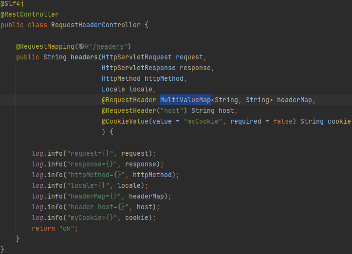

## 1. 로깅 간단히 알아보기

System.out.println() 대신 사용하는 로깅 시스템이다.  
스프링 부트 라이브러리를 사용하면 스프링 부트 로깅 라이브러리가 함께 포함된다.  

SLF4J와 Logback 이 두가지이다.  

SLF4J 라이브러리에는 다양한 로그 라이브러리가 들어있다.  

SLF4J는 인터페이스고, 구현체가 Logback 같은 로그 라이브러리라고 생각하면 된다.

> @RestController를 배우게 되는데, @Controller와 차이점이라면  
@Controller는 return시 반환되는것이 view 이름이 반환되는것이다.  
> 
> 그런데 @RestController를 입력하게 되면 return시 String이 바로 반환되게 된다.  
(해당 내용은 차후에 설명해주신다 하였다.)

log를 통해서 출력을 하게 되면 스레드의 정보, 컨트롤러의 이름, 메세지 까지 출력이 되다보니 많은 정보를 통해서 위치를 바로 찾을 수 있는 장점이 있다.

그리고 가장 중요한 기능으로는 trace, debug, info, warn, error의 로그를 출력할 수 있다.  

그 설정들을 application.properties 파일에서도 로그 레벨별로 제어가 가능하다.  

> `#hello.springmvc 패키지와 그 하위 로그 레벨 설정`
> `logging.level.hello.springmvc=trace`

상단처럼 입력하게 되면 "trace부터 모두 보여주겠다.(trace->debug->info->warn->error)" 라는 형태이다.  
LEVEL : `TRACE > DEBUG > INFO > WARN > ERRO`  
주로 운영서버에는 info부터 남긴다. 로컬에는 trace, debug를 사용하기도 한다.

명시를 안할 경우 info 부터 출력된다. 기본 설정이기 때문이다.  

출력할 때 `log.trace("trace log={}", name);` 형태로 출력하지않고  
`log.trace("trace log=" + name);` 형태로 출력하게 된다면 문자와 함께 해당 정보가 더해져서 보여지다보니 쓸모없는 리소스가 발생하는 것이다.  

설정을 통해서 파일로 로그을 남기거나 네트워크로 전송도 가능하다.

## 2. 요청 매핑

@RestController에 대한 내용을 한번 더 설명해준다. 뒤에서 더 자세히 설명을 해준다고 한다.  
RequestMapping에 대해 설명해주는데 Url 호출이 오면 이 메서드가 실행되도록 매핑한다.  
배열 설정도 가능하다.`{"/hello-basic", "/hello-go"}` OR 조건으로 된다.

method를 지정해주는걸 다시 테스트 한다. GET 방식으로 테스트를 진행하였다.  

그러고서 @GetMapping을 다시 설명해주었다.  

마지막으로는 PathVariable 스타일이라는걸 알려주었다.  
리소스 경로에 식별자를 넣어서 호출하는 형태를 선호한다.  
`@GetMapping("/mapping/{userId}")`

?는 쿼리 파라미터 방식이다. 해당 테스트는 PathVariable 방식인것이다.  
@PathVariable의 이름과 파라미터 이름이 같으면 생략할 수 있다.
다중으로도 사용이 가능하다.  

파라미터로 추가 매핑을 할 경우 특정 파라미터가 있을 때 호출이 가능하도록 설정도 가능하다.  
특정 헤더로도 가능하다.  

미디어 타입 조건으로도 매핑이 가능하다.  
Accept 헤더로도 매핑이 가능하다.  

## 3. 요청 매핑 - API 예시

Postman을 통해서 MappingClassController 테스트를 해봤다.

매핑 방법을 여러가지 예제를 보았다.

## 4. HTTP 요청 - 기본, 헤더 조회

MultiValueMap은 하나의 키에 여러 값을 받을 때 사용된다.  